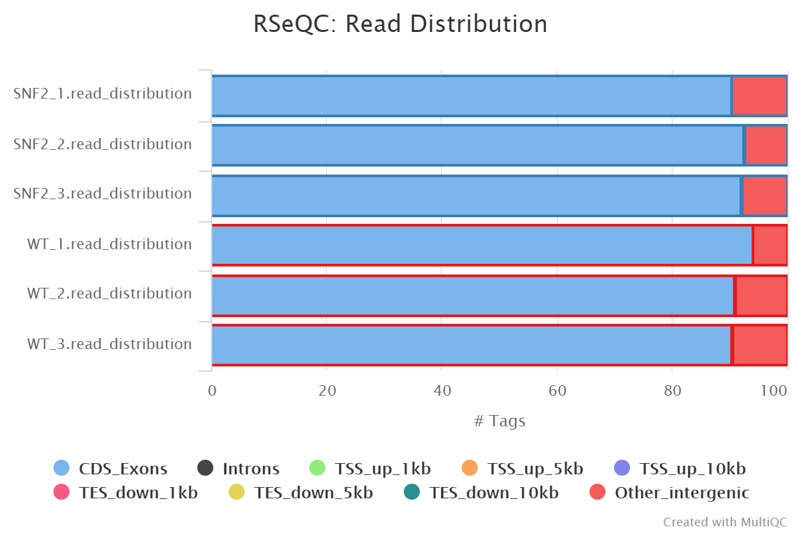
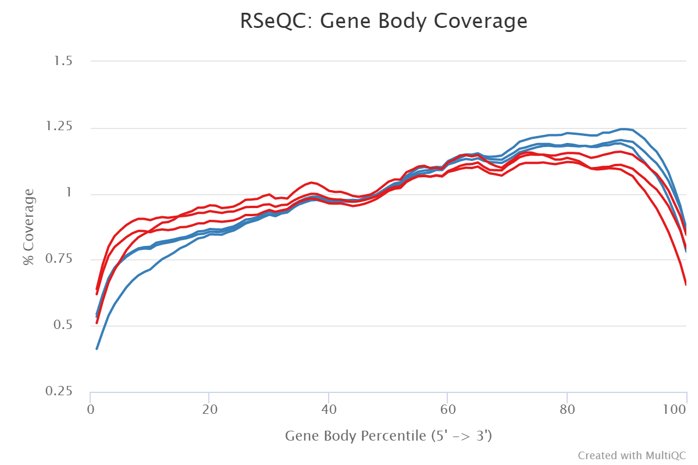
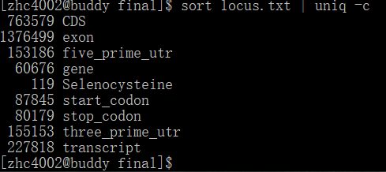

```{r setup, include=FALSE}
knitr::opts_chunk$set(echo = TRUE)
```

## RNA properties
####1. Why are reseachers interested in studing mRNA using RNA-seq, i.e. what can we learn from an RNA-seq experiment in contrast to a genomic DNA sequencing experiment?
What we can get from RNA-seq is the estimation of expression level of mRNA. Under different experimental conditions, the transcription level can change corresponding the the conditions, then we can identify what genes are responsible to it. 

When a transcript is highly expressd, we are supposed to get a high copy number of the same transcript, while in genomic DNA, each fragment is supposed to occur once (or twice for allels).

####2. Explain the differences between coding and non-coding RNAs:
#####which funtions do they have?
For coding RNAs, they would be further translated into peptide and become proteins, while for non-coding RNA, they can be components of proteins  (rRNA) such as ribosomes, or they can be actively functional such as tRNA, or carry out important regulatory functions such as small non-coding RNA.

#####which structural features set them apart from each other?
For coding RNAs, they have polyadenylic tails that can be used for enrichments, and for eukaryotic mRNA there are 5' cap structure which can also be used for capturing sometimes.

####3. Why can genetic mutations in intros be harmful? Name two possible scenarios that involve different underlying mechanisms.
Because introns are not always junk genes but instead can have functional elements or regions that responsible for gene regulation.

For example, mutations in promoter regions or terminator regions can cause problematic transcription because of 1) recognition failure by RNA Polymerase or 2) degradation of mRNA by non-stopping transcription. 3) In eukaryotes, splice points could be affected, causing alternative splicing or splicing shut down.

####4. Describe the difference between the transcription start site and the promoter.
The promoter region is the binding site for RNA Polymerase to start transription, while the transription start site is the first base that the mRNA synthesis begins (the first base of starting codon AUG). Usually promoter is the region that 25-30 based before the transcriptioin satrt site.

## Alignment QC
####1. Which problem of mRNA-sequencing can be detected with FastQC? Explain how.
mRNA degradation is the most possible to be detected with FastQC.

#####rRNA contamination
This can not be detected because this should be monitored after the extraction step via RIN scores, and the sequencer cannot distinguish between mRNA and rRNA after they are processed and form the library. This can be assessed via alignment quality control to see what ratio for reads to match rRNA region.

#####mRNA degradation
This is the most possible to be detected. We can inspect the **Sequence Duplication Levels** and see fi there is relative high duplication level larger than 10. If so, that may probably caused by partial mRNA degradation and thus only a small portional of mRNA is actually sequenced by many times.

#####genomic DNA contamination
This cannot be detected by FastQC but can be assessed via alignment quality control to see what ratio for reads to match non protein-coding region.

####2. Generate plots for (a) accessing the read distribution across exons/introns/etc. and (b)to determine the average gene body coverage. You can use either tool that we mentioned in the class. You can use any of the Gierlinski BAM file that you have generated, or use one from /home/frd2007/ANGSD_2019/alignment.
I choose to use BAM files of WT_1, WT_2, WT_3, SNF2_1, SNF2_2 and SNF2_3 to generate plots. First copy the *.bam* files and *.bai* files from the above directory.  

```{}
mkdir bams
for i in $(ls /home/frd2007/ANGSD_2019/alignment | egrep .*_[1-3]_Aligned)  
do  
cp /home/frd2007/ANGSD_2019/alignment/${i} ./bams  
done
```

The proper way to load RSEQC from singularity is illustrated in Merv's email. Here create a bash script to run batch rseqc for all the six samples.
`mkdir alignment_qc`  
`cd alignment_Qc`  
`mkdir WT_1`  
Commands omitted from WT_2 to SNF2_3  

Script **batch_rseqc.sh** to execute read_distribution.py and geneBody_coverage.py.  
```{}
mkdir -p alignment_qc

RSEQC_IMAGE="/athena/angsd/scratch/simg/rseqc-3.0.1.simg"  
BED_FILE="/home/frd2007/ANGSD_2019/RNA-seq/refGenome_S_cerevisiae/sacCer3.bed"  

for in in WT_1 WT_2 WT_3 SNF2_1 SNF2_2 SNF2_3  
do  
singularity exec $RSEQC_IMAGE read_distribution.py -r $BED_FILE -i ./bams/${i}_Aligned.sortedByCoord.out.bam > ./alignment_qc/${i}.read_distribution.txt  

singularity exec $RSEQC_IMAGE read_distribution.py -r $BED_FILE -i ./bams/${i}_Aligned.sortedByCoord.out.bam > ./alignment_qc/${i}.read_distribution.txt  
done  
```

After finishing the two precedures, I run multiqc to get the reports.  
`spack load -r py-multiqc@1.7`  
`mkdir multiqc`  
`multiqc ./ -o ./multiqc`  

Results shown as below:  







####3. Why is a 3' bias in the gene coverage plot evidence of RNA degradation? What type of enrichment step is particularly prone to overrepresenting the 3' ends?
We can think about that:  

a. If a mRNA transcript is not degraded, then the fragment of whole length could be captured and each fragment of it would be theoretically of equal probability to be ramdom primered and sequenced.  

b. However, if 3' terminal is degraded, then the transcript is less likely to be captured and thus lose the whole transcript.  

c. If for some reasons, the 5' end is degraded, broken and lost, then the 3' end can still be captured. Thus there is more chance for the 3' end fragments to stay in the library and get sequenced.

Poly-A selection would be prone to overrepresenting the 3' end for the above reasons beacuse it necessitates the existence of 3' end poly-A.

## Counting reads
####1. Use featureCounts to count the number of reads that overlap with every exon. As usual, keep track of all the commands. Briefly explain at least 2 parameters and their consequences that you're using(can include those in default).
First load featureCounts as part of subread and pass in BAM files from six samples.  
`spack load subread`  
`featureCounts -a /home/frd2007/ANGSD_2019/RNA-seq/refGenome_S_cerevisiae/sacCer3.gtf -T 8 -f -M -o featureCounts_Gierlinski_exons.txt ./bams/*.bam`  

Parameters:  
**-a**: Annotation file input.  
**-T**: Number of threads to use.  
**-f**: Perform read counting at feature levels.  
**-M**: Count multi-mapping reads.  
**-o**: Output file.  

####2. Read the summary files generated by the featureCounts run shown during class and the one you just did into R. Generate a bar plot (using ggplot2) that displays the numbers of assigned and unassigned reads for either featureCounts run. 
The featureCounts summary generated in the class is for reads mapping to genes, while in this assignment reads are mapping to exons.  
```{r}
read_exon <- read.csv("featureCounts_Gierlinski_exons.txt.summary", header = T, sep = '\t')
read_gene <- read.csv("featCounts_Gierlinski_genes.txt.summary", header = T, sep = '\t')
colnames(read_exon) = c("Status","SNF2_1","SNF2_2","SNF2_3","WT_1","WT_2","WT_3")
colnames(read_gene) = c("Status","SNF2_1","SNF2_2","SNF2_3","SNF2_4","SNF2_5","WT_1","WT_2","WT_3","WT_4","WT_5")

library(ggplot2)
library(tidyr)
read_exon <- gather(data = read_exon,
                    key = "samples",
                    value = "#reads", 
                    "SNF2_1","SNF2_2","SNF2_3","WT_1","WT_2","WT_3")
read_gene <- gather(data = read_gene,
                    key = "samples",
                    value = "#reads", 
                    "SNF2_1","SNF2_2","SNF2_3","SNF2_4","SNF2_5","WT_1","WT_2","WT_3","WT_4","WT_5")

read_exon <- read_exon[which(read_exon$`#reads`!=0),]
read_gene <- read_gene[which(read_gene$`#reads`!=0),]

read_exon$modes <- rep('exon_count',nrow(read_exon))
read_gene$modes <- rep('gene_count',nrow(read_gene))

df <- rbind(read_exon,read_gene)

g <- ggplot(df, aes(fill=Status,y=`#reads`,x=samples)) + geom_bar(position="dodge", stat="identity")
g <- g + coord_flip() + theme(legend.position = "bottom") + labs(title = "featureCounts Summary Statistics", subtitle = "featureCounts was run in 2 modes: counting reads per exons or per genes")

g <- g + facet_grid(rows = vars(modes))

print(g)

```

####3. Describe at least two observations from the plot including an explanation of what they mean.
a. Most of the reads are mapped to the exons and genes. This means the alignment quality is great.

b. Both have Unassigned_Ambiguity and Unassigned_NoFeatures. NoFeatures means even though the read has been mapped to the genome, but fail to identify what it is, while Ambiguity refers to a read mapped to multiple features.

####4. Download an annotation file (GTF) for one mammalian model organism of your liking. Determine the different types of loci that are annotated within that file and how many times each type is represent in that file (you may want to look into the uniq UNIX command).
I download the annotation file for human from Ensembl named **Homo_sapiens.GRCh38.99.gtf**.  By inspect the file I found that the 3rd column is types of locus, so extract the column and store it to a text file **locus.txt**.  

`egrep -v '#' Homo_sapiens.GRCh38.99.gtf  | cut -f 3 > locus.txt`  

The `uniq` command just checks the adjecent lines, so we need to sort the locus before passing it into `uniq`.  

`sort locus.txt | uniq -c`  

Results are shown as below:



There are totally 9 types of locus: CDS, exon, five_prime_utr, gene, Selenocysteine, start_codon, stop_codon, three_prime_utr and transcript.
